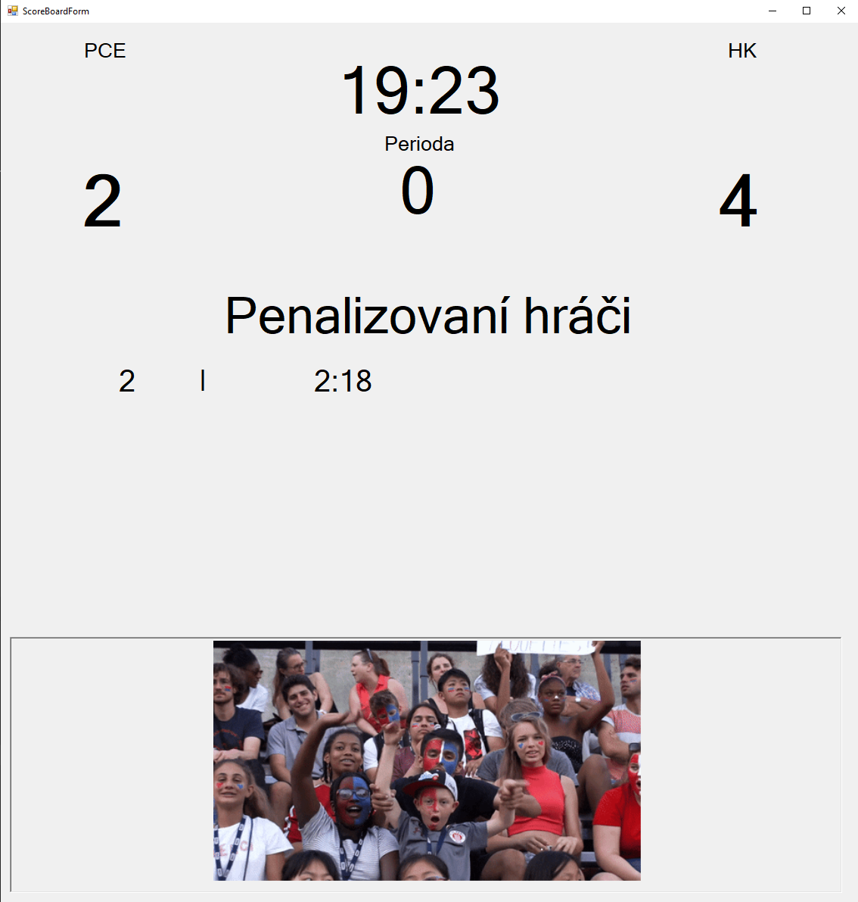

# Universal Score board
Universal score board application for mostly sports matches. 
It can display score, team name, count of period, left time of period, list of penalized players and spectator camera.

## 2 original custom features:
1. Players penalty display: 
    - Includes label with player number and label witch showing time to end the penalty.
    - Each penalty has own user control special for manager(parent) form and for the score board(child)
      - The parent control includes timer that countdown the left time to end of penalty and every tick actualize the label on score board.
      - At the end of penalty the parent automatically remove its child and it self
2.  Spectator camera:
    - Spectator camera randomly playing gifs from in root of project.
    - It should simulate the big displays on sport stadiums where camera man shows funny fans on tribune.
    
## Period and play time display:
- Display shows the time that left to end of period and it keeps this information in its own timer component.

## Example of code
```
public void StartCamera()
{
    _paths = Directory.GetFiles("./gifs/");
    _random = new Random();
    currentGifIndex = _random.Next(0, _paths.Length);
    _picSpectatorCamera.ImageLocation = _paths[currentGifIndex];
    timer1.Start();
}
```

## Example print screen of score board form
